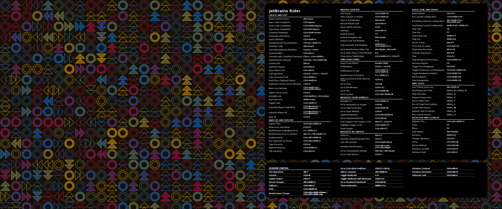

# JetBrains Rider Desktop Cheatsheet
I'm new to [JetBrains Rider](https://www.jetbrains.com/help/rider/Introduction.html) and really like it. Like many new converts I am a long-time Visual Studio user - so I brought over those keymaps (plus a few added manually that I brought over from VSCode) and thought *that would be that*. 

But recently I spent some time with a really great developer - [@michaeloyer]( https://github.com/michaeloyer ) - :bulb: who has a *JetBrains first* perspective. When we were reveiwing code that was new to both of us (:fire: hot on the trail of a pre-release bug :mosquito:) he talked me through using some of the Rider-original shortcuts - and I was sold. That experience told me it was time to make a fresh start. :sunrise: So I switched back to the JetBrains Rider keymap and got back to work.

## The Cheat Sheets

JetBrains allows you to export the keymaps to a PDF file, so I decided to use that to become more acquainted with the Rider command set. Eventually I started bumping into the PDF reader as I was context switching between work apps and that got to be annoying. So I decided to create a desktop wallpaper.

### Size (and OS) Matters

I created two wallpapers, one for work and one for my laptop. I'll eventually build one for my 4K screen when it arrives, but this is a start. If these choices/form factors don't work for you - don't worry. It's relatively easy to build your own - and the only thing it costs you is time. :hourglass_flowing_sand:

### 1080P formatted wall papers (WinOS keymaps)

## The Wallpaper JetBrains Magic

This ended up being a LOT of fun. And aside from whether you agree with my aesthetic choices (or OS version for keymaps, for that matter) you can certainly build your own - with a little bit of your own elbow grease - and a bit of magic from JetBrains. :mage:

## Simplest Thing First - The Cheat Sheet

So for my purposes I just exported the keymap from Rider using their keymap exporter plugin. That's where this began - with a PDF file. I wanted a "dark theme" background image so I simply did a screen grab of the PDF and then imported into a free image editor and inverted it. Simple! I did a bit of "rounded corner" editing of the image and *done*! So if you already have a favorite background image or just want to apply this cheat sheet to a solid background color - this is as far as you need to read.

*[Narrator: the JetBrains Desktop Art tool is really fun. You should try it.]*

### JetBrains Desktop Art Web Tool

The first thing - like always - was to perform a general search to see if anyone else had done something similar. That didn't yield any image results - but *did* show a really great resource - the [JetBrains Desktop Art web tool](https://www.jetbrains.com/company/brand/desktop-art/). I don't have particularly strong opinions on what my desktop should look like, and with a giant keymap cheat sheet covering a fair percentage of the "real estate" many stock backgrounds just get covered up. So the geometric "mosaic" created by JetBrain's tool really fit the bill. 

I played around with the settings on that page and it was really fun. They have color schemes and tile variations that correspond to each app, with a fair amount of mixing and matching that's available. But the thing that *really* caught my eye was the "magic" button, located to the far right of the controls. The randomization it provides really lets you "spin up something eye-catching" without having to spelunk through every control. That's how I landed on the provided design. But the light/dark variations you can create is really a kaliedescope that can be addictive.

Once you've landed on a design that suits your tastes/needs, the "Export" function allows you to write the result to an SVG file. This is really useful since the "footprint" of the image really doesn't match any pre-formatted desktop resolution. So I pulled the image into Inkscape and simply re-rendered it to an "oversize" fit for my QHD monitor in PNG format. I then opened it up in a free image editor and did some cropping/arranging the cheat sheet overlay and exported to a new image. 

## Fun & Profit

This was a gratifying exercise - not only does it smooth out the learning curve for JetBrains Rider but it also gratifies my creative side a bit. And you should try it too. The export of the keymap to PDF was just a matter of adding the plugin in the editor (you'll find it under the Help menu after install) and you can customize things further to suit your needs. I love an easy win. :trophy:

### QHD formatted wallpapers (WinOS keymaps)

